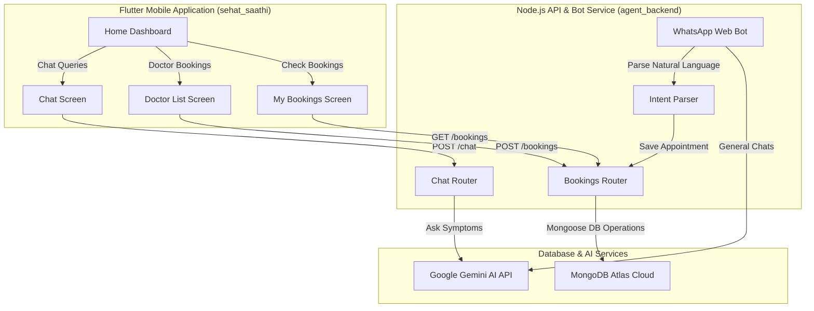

# Sehat Saathi (صحت ساتھی) - Pharmacy-Led Health Orchestrator

## Safety & Localization Standards
Native languages to maximize accessibility for patients across Pakistan.

- **Government Scheme Awareness**: Directly maps health support with the Pakistani Sehat Sahulat Program, ensuring users can verify coverage effortlessly.

## Demo Video
[Watch Demo](https://youtu.be/OPNRm2WQDu4)

## How to Run
```bash
flutter run
# Sehat Saathi (صحت ساتھی) - Pharmacy-Led Health Orchestrator 🩺🌱

Sehat Saathi is a cutting-edge mobile health orchestration platform built for Pakistan's unique climate-sensitive healthcare challenges. Designed for the **Climate Agent Challenge 2**, it bridges the gap between environmental realities and healthcare accessibility. The platform empowers users by combining real-time city-specific climate health alerts (such as Heatwave Advisories, Smog Warnings, and Pollen Alerts) with an AI-driven digital health suite.

---

## 🌟 Key Features

### 1. 📱 Flutter Mobile App Suite
- **🌱 Climate-Health Dashboard**: Instantly presents weather and climate-sensitive warning banners (e.g., Heatwave in Karachi, Smog in Lahore, Pollen Allergy in Islamabad) with personalized protective guidance.
- **🤖 Ask Sehat Saathi AI**: A conversational chatbot that communicates in Urdu, Roman Urdu, and English, providing symptom support, Sehat Card information, and drug alternatives.
- **🩺 Book Doctor**: Browse specialized doctors (General Physicians, Cardiologists, Dentists) and schedule appointments with direct MongoDB storage.
- **🏥 Find Hospital**: Search and locate nearby hospitals by disease focus (General, Cancer, Heart), filtering specifically for Sehat Sahulat Card (Government Health Card) coverage and tracking real-time wait times.
- **🧪 Drug-to-Drug Interaction Checker**: Select multiple medicines (e.g. Aspirin, Warfarin) to instantly check for hazardous interactions, complete with Urdu and English warning highlights.
- **📸 Prescription Scanner**: Smart Mock OCR scanner which parses prescription pictures to extract medicine names automatically.
- **💊 Check Medicines**: Lookup prices, active ingredients, and alternative drugs, indicating whether the medicine is covered by the Sehat Card.
- **📅 My Bookings**: View, manage, and keep track of all upcoming doctor appointments directly synced from the server database.

### 2. ⚡ Intelligent Node.js Backend
- **🔑 Gemini API Integration**: Powers the interactive AI chat endpoint (`/chat`) using standard Google AI SDKs (`gemini-1.5-flash`) with advanced Pakistani healthcare system prompts.
- **🍃 MongoDB Database**: Robust integration utilizing Mongoose to securely store, retrieve, and organize patient appointments.
- **💬 WhatsApp Web Bot Client**: Connects via `whatsapp-web.js` to parse natural language booking requests from patients (e.g., *"mujhe Karachi me dentist ki appointment chahiye"*) and automatically records bookings.
- **🤖 WhatsApp AI Agent fallback**: If the WhatsApp message is a general health query, the bot uses the Gemini API to respond with instant medical guidance.

---

## 🛠️ Architecture & Tech Stack



---

## 🚀 Setup & Installation Instructions

### Prerequisites
- **Flutter SDK**: `^3.0.0` or higher
- **Node.js**: `^18.x` or higher
- **MongoDB**: Access to MongoDB Atlas (pre-configured URI is included in code)
- **Gemini API Key**: A valid Google Gemini API key

---

### 1. ⚡ Setting Up Backend (`agent_backend`)

1. Navigate to the backend directory:
   ```bash
   cd agent_backend
   ```

2. Install dependencies:
   ```bash
   npm install
   ```

3. Configure environment variables. A `.env` file has been pre-configured for your convenience. Ensure it contains the following keys:
   ```env
   GEMINI_API_KEY=your_gemini_api_key_here
   ```

4. Run syntax verification:
   ```bash
   node -c index.js routes/bookings.js routes/chat.js intentParser.js models/Booking.js
   ```

5. Start the backend server:
   ```bash
   npm start
   ```
   *The server will start running on port `3000`. If you run the WhatsApp Web Client for the first time, scan the terminal QR code using your WhatsApp Web link.*

---

### 2. 📱 Setting Up Frontend (`sehat_saathi`)

1. Navigate to the Flutter project directory:
   ```bash
   cd sehat_saathi
   ```

2. Retrieve Flutter packages:
   ```bash
   flutter pub get
   ```

3. Perform codebase analysis to ensure code is clean:
   ```bash
   flutter analyze
   ```

4. Launch the application:
   - For Android Emulator (uses standard `10.0.2.2:3000` bridge):
     ```bash
     flutter run
     ```
   - For iOS / Web / physical devices:
     Ensure the endpoint IP in `chat_screen.dart`, `doctor_list_screen.dart`, and `my_bookings_screen.dart` matches your machine's local area network (LAN) IP.

---

## 🔒 Safety & Localization Standards
- **Disclaimer Enforcement**: Every interaction with Sehat Saathi AI starts with a prominent disclaimer highlighting that AI is not a substitute for human doctor clinical diagnostics.
- **Urdu/Roman Urdu Adaptation**: Fully understands and replies in native languages to maximize accessibility for patients across Pakistan.
- **Government Scheme Awareness**: Directly maps health support with the Pakistani Sehat Sahulat Program, ensuring users can verify coverage effortlessly.

